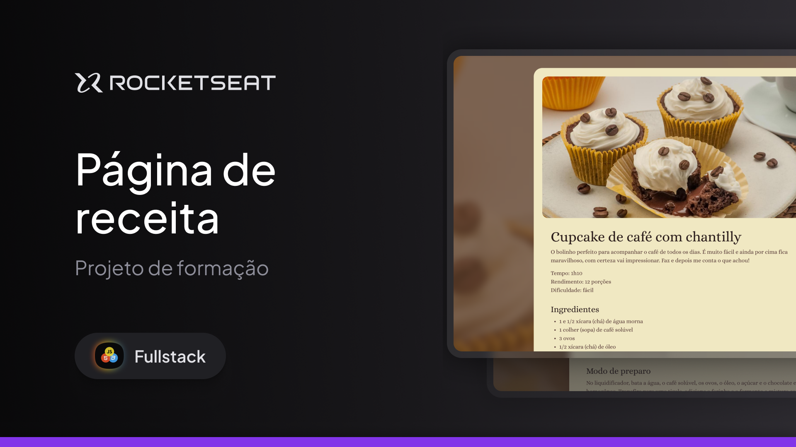

<h1 align="center"> Página de receita </h1>

Uma página de receita de Cupcake com café.

 

  

 

## 🚀 Tecnologias

Esse projeto foi desenvolvido com as seguintes tecnologias:

- HTML e CSS

## 💻 Projeto

Um projeto que ensina uma receita de cupcake.

## 💙 Contato 
nathangja09@outlook.com

---
Feito com ♥ by Rocketseat.